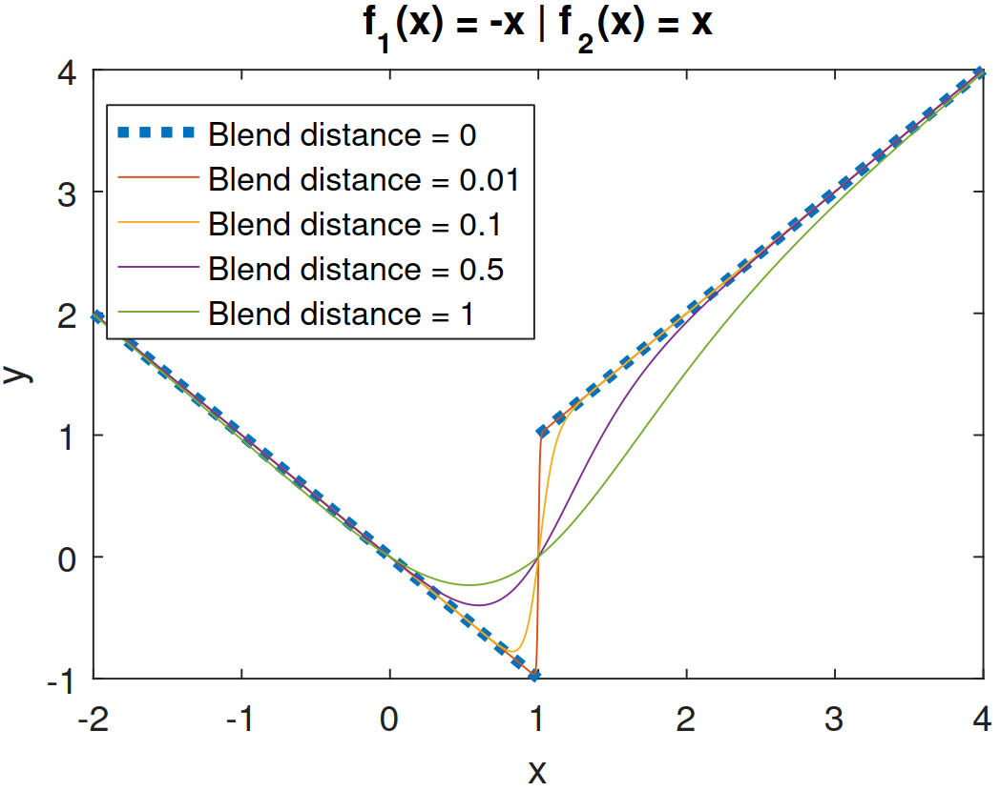

# piecewise & blend
Create piecewise functions or smoothly blend functions.

## piecewise
Create a piecewise function handle.

foo = PIECEWISE(f1,border,f2,border,f3,...) returns a function handle to a piecewise combination of provided functions (or constants), transitioning from one function to the next at the specified borders. When evaluate at the border, the function will return the midway value between functions.

## blend
Uses hyperbolic tangent (tanh) to smoothly blend two functions or smoothly combine a piecewise function into a single function handle.

foo = BLEND(f1,f2,LOC,DIST) returns function handle foo which, when evaluated, will return a smooth blend between functions provided in handles f1 and f2.

